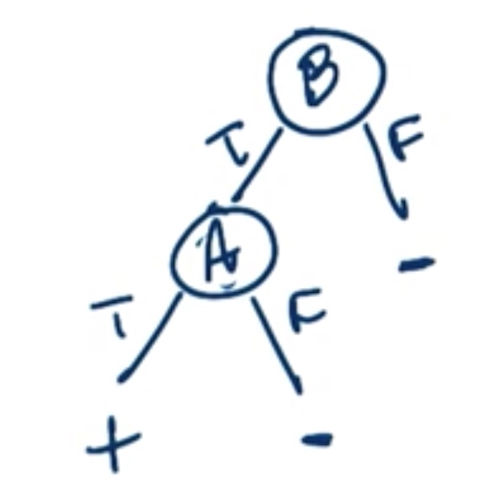
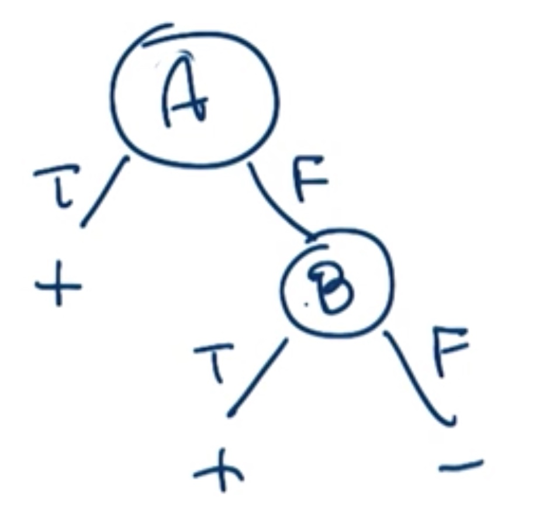
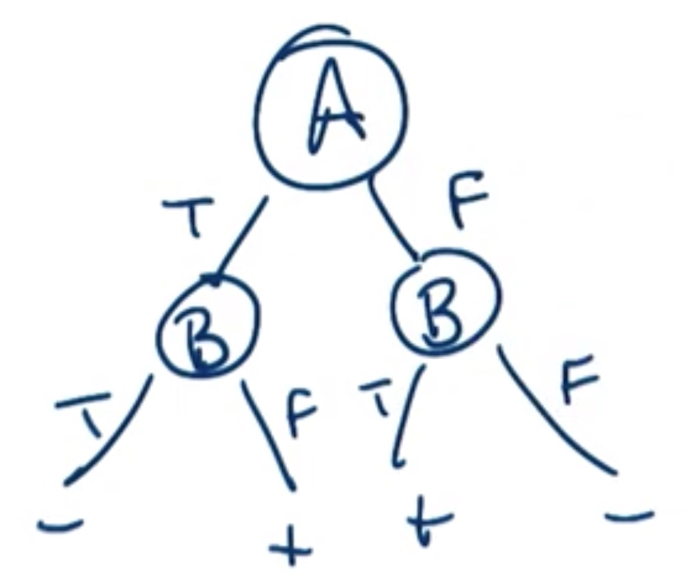
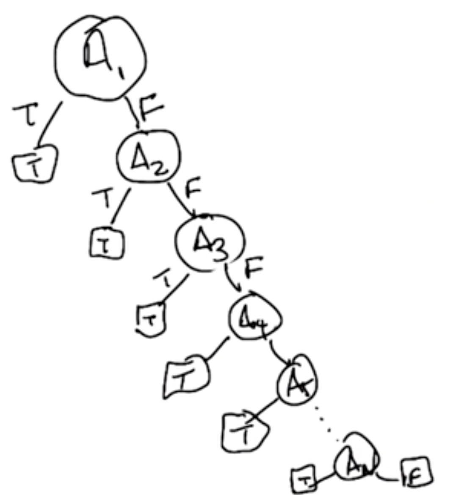
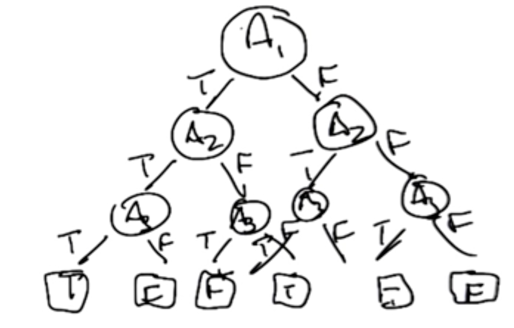

# L2 Decision Tree

## Supervised Learning Classify

- Classification
 Classification is simply the process of taking some kind of input, let's call it x. Mapping it to some discrete label, something like, true or false.

- Regression
 Talk about later..
 
##How to identify ?
to determine if something is classification or regression is whether the output is from a discrete small set or whether it's some continuous quantity.

**Is it a Classification or Regression typically depends on the output.**

##Some terms of Classification:

- **Instances**: input (images, credit scores...)
- **Concept**: function that maps input and output (kind of description of the output)
- **Target concept**: Answer that we try to represent
- **Hypothesis** class: Set of all concepts(classification functions)
- **Sample**: Training set(Input with correct label of input, pairs)
- **Candidate**: Concept that might be target concept
- **Testing set:** Same as training set but cannot be same

##Decision Tree
### Decision tree: learning

1. Pick **best** attribute to split the data
2. Ask question
3. Follow the answer path
4. Go to 1 until get the answer

### Decision tree: expressiveness
- **AND**: A and B should both be **"+"**
 The order of A and B are **NOT** necessary

 

- **OR**: A B both false then get **"-"**
 The order of A and B are **NOT** necessary
 
 

- **XOR**: A and B are different should be **"+"** 

 

- **n-OR:** Any function, any of them is true then **"+"**

  \# of node: n (linear)

 

- **n-XOR:** Parity, odd \# of node are true then **"+"**

 exponential(evil) 

 

>More Any, less Exponential

## ID3 Algorithm

[What is ID3](https://storage.googleapis.com/supplemental_media/udacityu/313488098/ID3%20Algorithm%20for%20Decision%20Trees.pdf) Check it out!

### Induction Bias

- Restriction Bias
- Preference Bias

**A good decision is :**

1. Good split near the top of the tree
2. Correct over incorrect
3. Shorter Tree

## Some considerations of decision tree
### What we do to continuous input?
For now we only discuss discrete input, what if the input is continuous like age, weight, distance.

We could use **RANGE!!**

### Does it make sense to repeat an attribute along a path in the tree

For discrete question: NO
For continuous question: YES

### When do we stop?
- Everything classified correctly
- No more attributes
- No overfitting: Really good at classifying the training data but doesn't help for generalize.
- Pruning: deal with overfit and get smaller tree.

### Use decision tree for regression?
- Splitting, Variance
- Output: average, local linear fit

